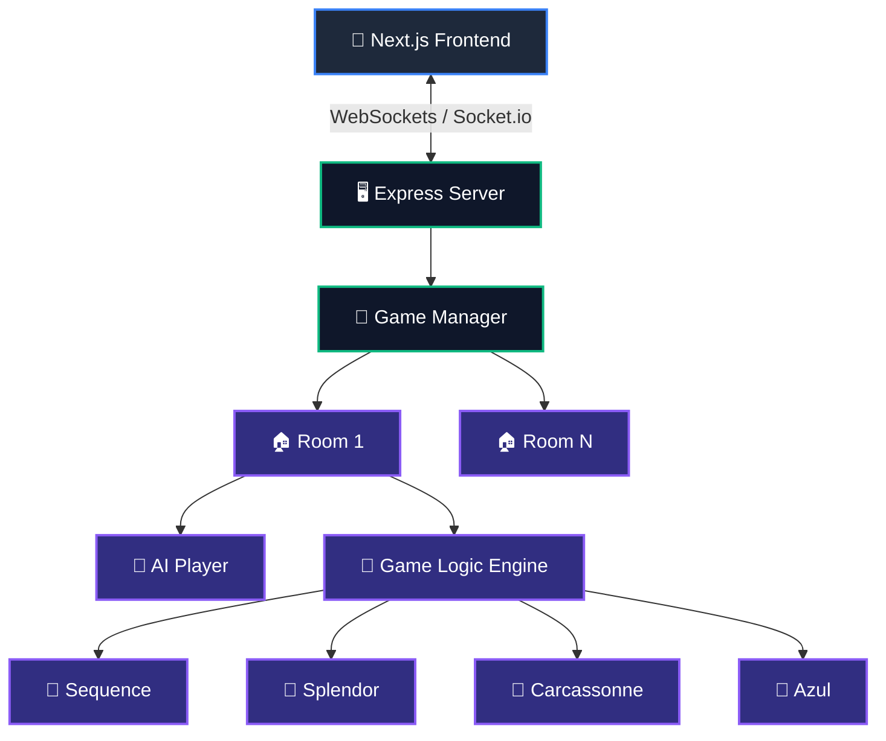
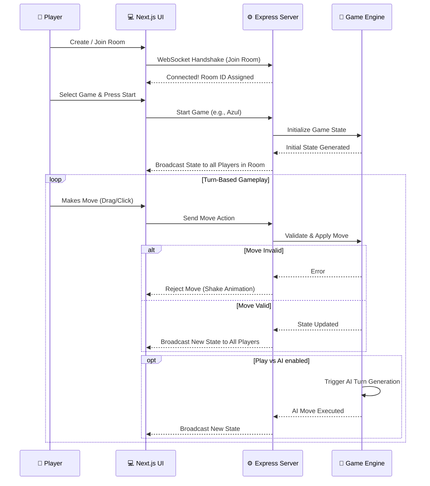
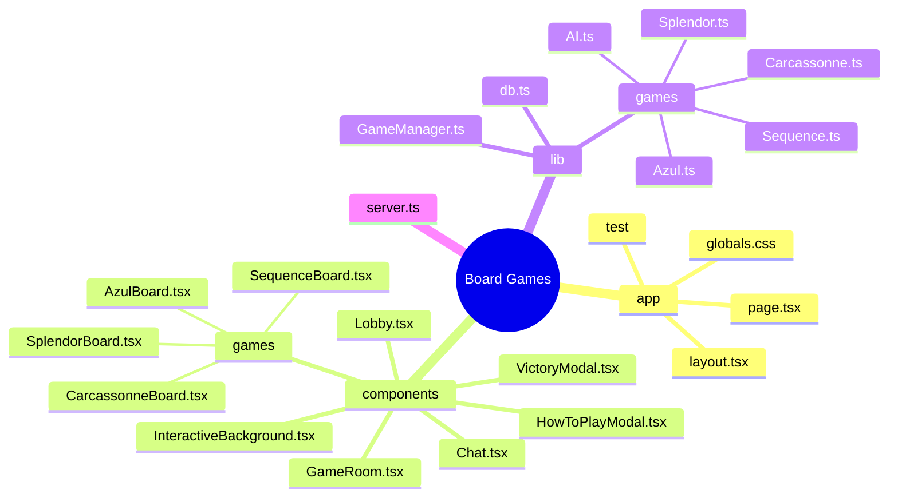

<div align="center">
  <h1>🌌 Board Games</h1>
  <p><strong>Cosmic-Themed Multiplayer Board Games Lounge</strong></p>

  [](https://nextjs.org/)
  [](https://www.typescriptlang.org/)
  [](https://socket.io/)
  [](https://tailwindcss.com/)
</div>

> [!NOTE]
> **Board Games** is a real-time multiplayer gaming platform featuring a beautiful dark-mode interface styled with cosmic animated gradients and interactive canvas particle backgrounds.

---

## 🎮 Features & Supported Games

### 🎯 Sequence
* **Objective:** Connect 5 chips in a row (horizontal, vertical, or diagonal).
* **Mechanics:** Use Two-Eyed Jacks as wild cards and One-Eyed Jacks to remove opponent chips.
* **UI Features:** Dynamic card hands, cell highlights (yellow for playable, red for removable), and auto-locks for completed sequences.

### 💎 Splendor
* **Objective:** First player to reach 15 points wins.
* **Mechanics:** Collect gem tokens (White, Blue, Green, Red, Black, and Gold). Purchase development cards to build permanent gemstone bonuses. Attract Nobles for bonus points.

### 🏰 Carcassonne
* **Objective:** Score points by completing features and placing meeples.
* **Mechanics:** Place medieval terrain tiles (Cities, Roads, Monasteries) on a shared board.
* **UI Features:** Supports drag-to-pan, scroll-to-zoom, and tile rotation.

### 🎨 Azul
* **Objective:** Complete your decorative palace wall without breaking tiles.
* **Mechanics:** Draft mosaic tiles from circular factories. Manage tile overflow penalties and claim tile set completion bonuses.

> [!TIP]
> **Single-Player AI Mode**
> Toggle the "Play vs AI" mode in any lobby! The smart AI engine will analyze boards, build paths, evaluate market cards, rotate tiles, and score pattern lines automatically so you can play solo.

---

## ✨ Visual and Interaction Design

* 🌌 **Interactive Background**: Animated canvas-based particle network that drifts in the background. Particles establish links with nearby nodes and react to mouse cursor/touch hover gravity.
* 🎨 **Cosmic Theme**: Deep animated gradient background with a cardboard texture overlay. Visual accents use blue-purple-pink text gradients and glowing focus highlights.
* ⚡ **Micro-Animations**: Custom validation toasts paired with hand-shaking animations for instant feedback on invalid moves.
* 📱 **Responsive Layout**: Mobile-first design, overlapping card hands, floating widgets, and a toggleable slide-out chat panel.

---

## 🚀 Setup and Installation

### Prerequisites
Make sure you have Node.js installed (v18 or v20 recommended).

### 1. Install Dependencies
```bash
npm install
```

### 2. Configure Environment
Create a `.env` file in the root directory:
```bash
echo "PORT=3000\nNODE_ENV=development" > .env
```

### 3. Run the Development Server
Real-time gameplay uses a combined HTTP and WebSockets connection. Start the server:
```bash
npm run dev
```
Navigate to [http://localhost:3000](http://localhost:3000) in your browser.

---

## 🗺️ Visual Project Architecture

This project uses a centralized WebSocket server (Express + Socket.io) to manage various isolated game instances in real-time. Below is a visual representation of the architecture. *(These diagrams render natively in Obsidian and GitHub).*

### System Overview



### Real-Time Gameplay Flow



---

## 📁 Directory Structure Breakdown



> [!IMPORTANT]
> If you are exploring this repository in **Obsidian**, the mermaid diagrams above will render natively as interactive graphs! You can also utilize Obsidian Canvas to lay out the markdown files visually.
